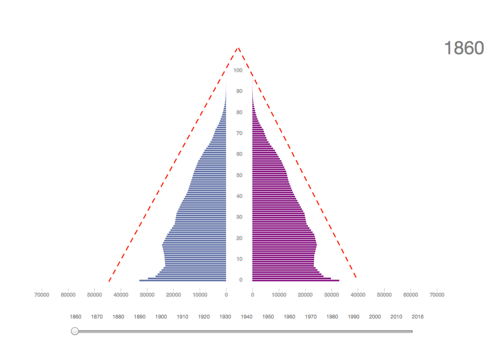

# **Pyramide des âges**
#### Visualisations des statistiques d'évolution de la population en Suisse entre 1860 et 2016 

Disponible en ligne : [ici](https://roubaka.github.io/) 

Ce projet a été effectué dans le cadre du cours de *Visualisation de données* donné par Isaac Pante (Faculté des Lettres, Université de Lausanne, SP2017). 

## Description 

C'est une application interactive qui permet de visualiser de manière dynamique l'évolution de la population en Suisse durant les 150 dernières années. 

La pyramide des âges est une représentation graphique de la structure de la population selon l'âge et le sexe à un moment donné. Elle est constitué par convention de deux histogrammes, un pour chaque sexe (par convention les hommes à gauche et les femmes à droite). Les âges sont distribués en ordonnée et les effectifs en abscisse. 

C'est dans le premier Atlas statistique des Etats-Unis paru en 1874 que ce type de graphique apparaît. Il tient son nom de la forme initiale du graphique qui représente une pyramide comme il est possible de le voir en 1860. 

Il est possible grâce à la pyramide des âges de voir l'évolution de la population d'un pays. Celle-ci est influencée par le taux de fécondité, le taux de mortalité ainsi que l'espérance de vie. Au fil du temps, ces différents indicateurs ont évolué et fortement influencé la structure de la population représentée par la forme de la pyramide. 
En effet, la pyramide de 2016 comme il est possible de le voir ci-dessous n'a plus vraiment une forme de pyramide mais plutôt de champignon. 

La pyramide des âges interactives permet de naviguer au fil du temps afin de voir l'évolution de la population selon les périodes historiques. De ce fait, il est possible de voir, en 1934, une diminution importante du nombre de femmes et d'hommes entre 15 et 20 ans. Ceci s'explique par l'épidémie de grippe espagnole ayant frappé la Suisse 15 ans auparavant. 

La pyramide des âges permet de mettre en avant les variations de population. En effet, le baby-boom de la fin de la 2ème guerre mondiale ainsi que les pics suivants (les enfants et les petits-enfants des baby-boomer) sont visibles sur le graphique. 

Ce  type de graphique permet  donc de garder une trace à long terme des crises du passé comme les guerres, les épidémies, les maladies mais également les augmentations de la natalité. 

## La pyramide des âges interactive 

###  Construction 

### Les données

### Utilisation  

Il suffit d'avoir accès à internet et de se rendre [ici](https://databinch.github.io)

Vous atteignez la page d'accueil qui varie selon le support utilisé. 

### Public cible 

La pyramide des âges s'adresse principalement aux statisticiens où aux géographes devant analyser des données démographiques. Il est important qu'ils puissent interagir avec les données et observer l'évolution dans le temps en utilisant la fonction "Play" par exemple. Cette application s'adresse également à toute la population intéressée à suivre l'évolution de la population de la Suisse. 

## Sources

- Office fédéral de la statistique, OFS, disponible en ligne : https://www.bfs.admin.ch/bfs/fr/home/statistiques/themes-transversaux/mesure-bien-etre/tous-indicateurs/societe/rapport-personnes-agees.assetdetail.3302625.html

- Institut national d'études démographiques, INED, disponible en ligne : https://www.ined.fr/fr/lexique/pyramide-des-ages/

- 

